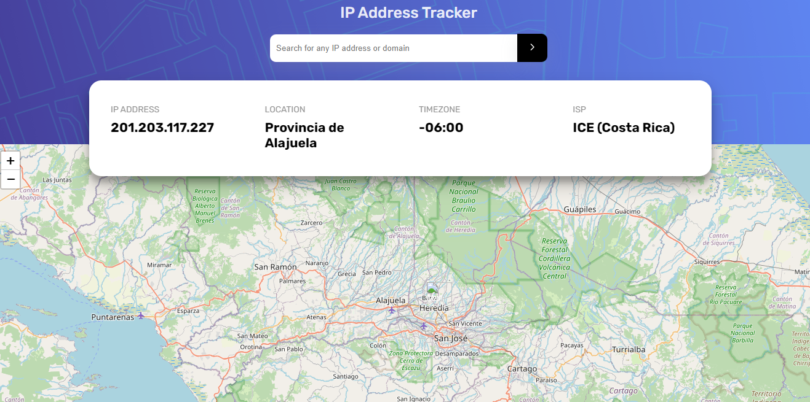
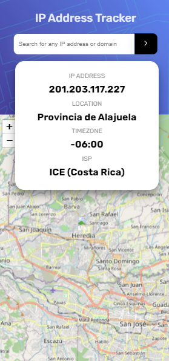

# Frontend Mentor - IP address tracker solution

This is a solution to the [IP address tracker challenge on Frontend Mentor](https://www.frontendmentor.io/challenges/ip-address-tracker-I8-0yYAH0). Frontend Mentor challenges help you improve your coding skills by building realistic projects.

## Table of contents

- [Overview](#overview)
  - [The challenge](#the-challenge)
  - [Screenshot](#screenshot)
  - [Links](#links)
- [My process](#my-process)
  - [Built with](#built-with)
  - [What I learned](#what-i-learned)
  - [Continued development](#continued-development)
- [Author](#author)

## Overview

An small summary about the challenge is that users should be able to search and find the location, timezone, ip address and isp of whatever domain or ip address they want.

### The challenge

The challenge is to build out this IP Address Tracker app and get it looking as close to the design as possible. To get the IP Address locations, i'll be using the [IP Geolocation API by IPify](https://geo.ipify.org/). To generate the map, we recommend using [LeafletJS](https://leafletjs.com/).

### Screenshot

Here are some screenshots of the final solution

### Links

- Live Site URL: [Live Url](https://ipaddresstracker-mgf.netlify.app/)

## My process

### Built with

- Semantic HTML5 markup
- CSS custom properties
- Flexbox
- CSS Grid
- Mobile-first workflow
- [React](https://reactjs.org/) - JS library
- [React-Query](https://tanstack.com/query/latest/docs/framework/react/overview)
- [Zustand](https://zustand.docs.pmnd.rs/getting-started/introduction)

### What I learned

In this project i've learned a lot of using in a better way zustand and react-query, because that topics were a problem for me in the recent proyects that i did and i feel very proud of myself to try to apply this and did it in a better way than before.
This can be small but for me as a junior is new and was using multiples apis to get the challenge done and that made me enjoy more this challenge and stress me out a bit YEAHH!!! just a bit.
The most important part was that i could be able to complete the challenge and prove myself that i can do it even if i don't know how and that was the best part of this challenge.

### Continued development

I learn a lot but obviously i have to improve more in the way a code try to be more eficient and challenge myself to get better
Maybe i would love to try more complex app or challenge to make be more curious and force me to learn new topics

## Author

- Website - [Marcelo Garita Fonseca](https://marcelogf-portfolio.netlify.app/)
- Frontend Mentor - [@marcelogaritaf](https://www.frontendmentor.io/profile/marcelogaritaf)
- GitHub - [@marcelogaritaf](https://github.com/marcelogaritaf)
